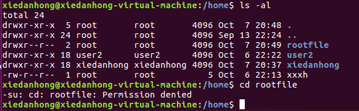

# 用户与root

## root

​	登录ubuntu后，按上组合键CTRL+ALT+T进入终端界面，一般终端界面默认为普通用户权限模式。

`sudo su`  输入密码 `--->进入root权限`

`ctrl+D` 退出

`CTRL+ALT+F1` 切换命令行窗口

`CTRL+ALT+F7` 切换回X Windows

##### 切换用户：

`su username`  `---> 不切换环境变量`

`su - username`  `---> 完整的切换到新的用户环境`

## user

`adduser username` `---> 在home下建立用户`

（`useradd username` `---> 只建立了用户，home下 密码...都没有`）

`userdel username` `--->删除用户`

`cat /etc/passwd` `--->查看用户信息`

`userdel -r username` `--->将home下的用户文件夹也删除`

`usermod -a -G groupname username`  将已有用户添加到已有用户组

`usermod -g groupname username` 修改用户当前的用户组（要先添加到改组才能修改当前组）

`groups` 查看用户所在组

## 用户身份与群组记录的文件

用户信息：/etc/passwd

`账号名称:用户密码:用户标识码（UID）:组标识码(GID):用户相关信息:用户home目录:用户环境`

GID是当前有效分组

个人密码：/etc/shadow

群组：/etc/group

## 改变文件属性与权限

`ls -al  --->`  `drwxr-xr--   1 test1    testgroup    5238 Jun 19 10:25 groups/`

d表示目录，-表示文件

other的权限中[r--]虽然有r ，但是由于没有x的权限，因此others的使用者，并不能进入此目录！

`chgrp [-R] groupname dirname/filename`  改变所属群组

`chown [-R] username[:groupname] dirname/filename`

 改变文件所属者（与群组）

`cp 来源文件 目标文件`  要记得改变文件的群组和拥有者，复制行为(cp)会复制执行者的属性与权限

`chmod [-R] xxx dirname/filename`  改变文件权限，xxx：664/775...

`chmod u=rwx,g=rx,o=r filename` 

`chmod  a-x  .bashrc`  去掉所有人的可执行权限

##### 权限对于目录

r 表示具有读取目录结构列表的权限，可以查询该目录下的文件名数据。可以利用 ls 这个指令将该目录的内容列表显示出来！

w 

- 建立新的文件与目录；
- 删除已经存在的文件与目录(不论该文件的权限为何！)
- 将已存在的文件或目录进行更名；
- 搬移该目录内的文件、目录位置。

x 用户能否进入该目录成为工作目录。能不能进入某一个目录，只与该目录的x权限有关

# 文件种类

##### 数据输送文件(FIFO, pipe)：

FIFO也是一种特殊的文件类型，他主要的目的在解决多个程序同时存取一个文件所造成的错误问题。
FIFO是first-in-first-out的缩写。第一个属性为[p] 。

##### 数据接口文件(sockets)：

既然被称为数据接口文件，这种类型的文件通常被用在网络上的数据承接了。我们可以启动一个程序来监听客户端的要求，而客户端就可以透过这个socket来进行数据的沟通了。第一个属性为 [ s ]，
最常在/var/run这个目录中看到这种文件类型了。

## other命令

`ls` 查看当前目录下有那些文件

`pwd` 查看当前路径

`cat xxx` 查看xxx文件内容

`echo $PATH` 

`cd ..` 进入上一级目录

`cd` 进入该用户home目录

`vi filename` 创建文件

`echo “xxx" > filename` 向文件filename写入xxx

`echo “xxx" >> filename` 向文件filename追加写入xxx

`touch filename`  创建空文件

`mkdir dirname`  创建目录

`rm -rf dirname`  删除目录

##### 修改语言

`echo $LANG` 显示当前语系

`LANG=en_US` 修改为英文

## 问题：

1、把user2创建的文件222.txt的群组和所属者g改成了xiedanhong/root（文件在user2的home目录下），xiedanhong 为什么还是无法删除，提示权限不够，user2自己可以删除

xiedanhong没有权限在/home下写文件和删文件

解释：

在/home目录下，每个用户只对自己的目录有w权限，只有w权限才有删除已经存在的文件与目录(不论该文件的权限为何！)

没有x权限不能切换到该目录（rootfile）

将目录所属者改成xiedanhong，即rwx(w)就有权限删除目录了（目录下所有文件所属者都要改）

